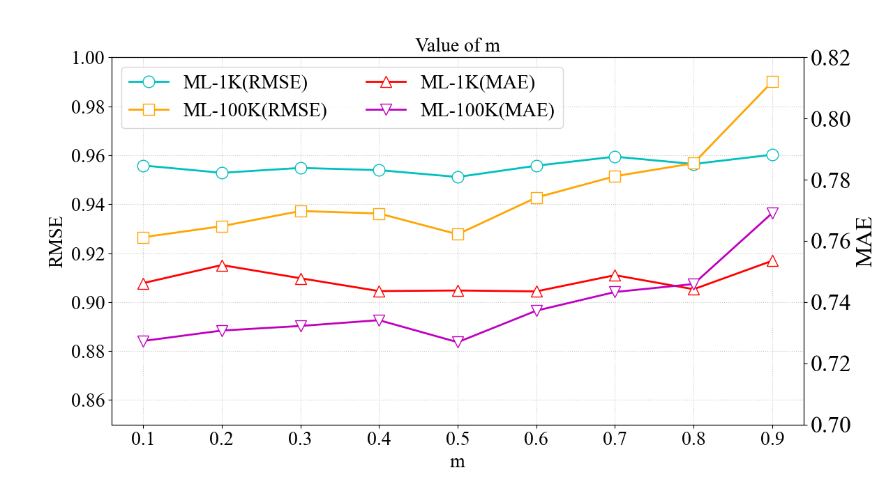
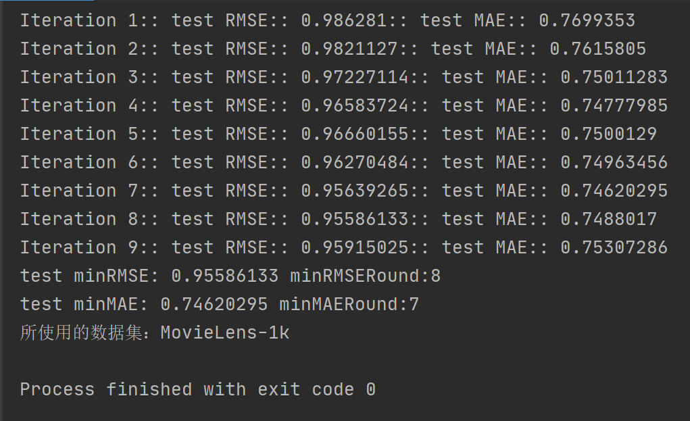

# SGDE-PLFA

This repository is an official MindSpore implementation of our paper "A Differential Evolution-Enhanced Position-Transitional Approach to Latent Factor Analysis". (*IEEE Transactions on Emerging Topics in Computational Intelligence, 2022*). [[download](https://ieeexplore.ieee.org/abstract/document/9839514)]

## Prerequisites:

1. MindSpore 2.1.1
2. numpy

## Dataset

All datasets used in this Paper are follows.

|  Datasets  | U  |  I  | Lambda | Data Density |
| :--------: | :----: | :-----: | :----------: | :----------: |
|   ML10M    | 12,547 | 35,250  |      4       |    1.31%     |
| ExtEpinion | 11,023 | 280,755 |      13      |    0.015%    |
|  Flixter   | 7,181  | 253,820 |      30      |    0.11%     |
|   Douban   | 11,751 | 270,667 |      5       |    0.22%     |

Considering the trainging time, the datasets used in the repository are movielens-1k and movielens-100k.
## Results

### "RMSE & MAE with value of m"
<p align="center">

</p>

### "RMSE & MAE with value of β"
<p align="center">

</p>

### "Convergence curve"

<p align="center">

</p>

### "minRMSE & minMAE"

<p align="center">

</p>


## Citation

If you find our papers useful in your research, please consider citing:

```
@article{chen2022differential,
  title={A differential evolution-enhanced position-transitional approach to latent factor analysis},
  author={Chen, Jia and Wang, Renfang and Wu, Di and Luo, Xin},
  journal={IEEE Transactions on Emerging Topics in Computational Intelligence},
  volume={7},
  number={2},
  pages={389--401},
  year={2022},
  publisher={IEEE}
}
```
